<div align="center">

# TaskBarStatsMobile (experimental)

**Live memory, network, storage and ping on your Android phone: status bar, widgets, notification and cockpit.**

<a href="https://github.com/ericbruggema/TaskBarStatsMobile/releases/latest"></a>

<sub>Open the page and tap the <code>.apk</code> under <em>Assets</em>. The app can also check for updates itself (off by default).</sub>

<a href="https://github.com/ericbruggema/TaskBarStatsMobile/releases/latest"></a>
<a href="https://github.com/ericbruggema/TaskBarStatsMobile/actions/workflows/android.yml"></a>


**English** · [Nederlands](README.nl.md) · [Deutsch](README.de.md)

</div>

TaskBarStatsMobile is the Android companion of the Windows monitor [TaskbarStats](https://github.com/ericbruggema/TaskbarStats): live memory, network, storage, ping and temperature on an Android
phone or tablet, as a dashboard, a fullscreen cockpit, a home-screen widget, an ongoing notification (also on the
lock screen), a Quick Settings tile and tiny figures **in the status bar** next to the clock and system icons. Tiles can be hidden and reordered, each widget has its own settings, and CPU % is optional (see below).
The battery is left out on purpose: Android already shows it everywhere.

This is a separate Kotlin / Jetpack Compose app, not a port of the WinForms code. It shares the idea, the
colour themes and the layout of the Windows app, nothing else.

| Dashboard | Cockpit | Widget & settings |
|---|---|---|
| 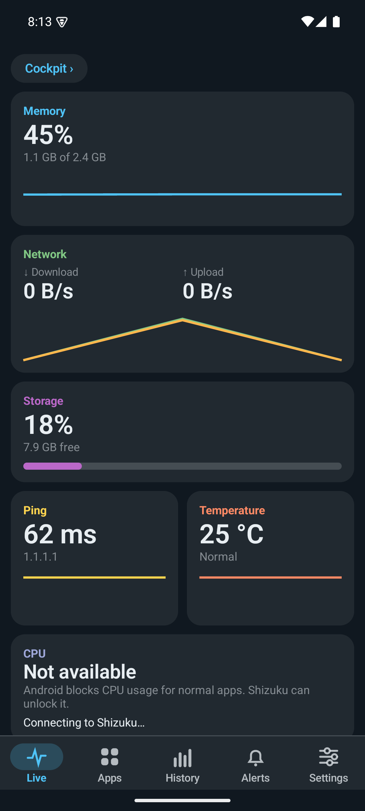 | 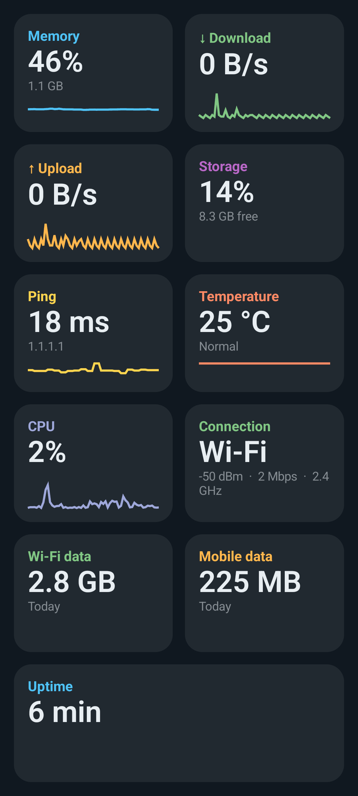 | 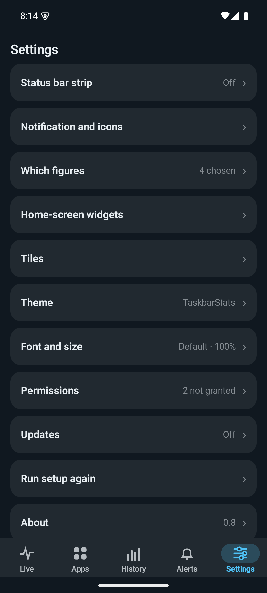 |

| Home-screen widget | Notification | Lock screen |
|---|---|---|
| 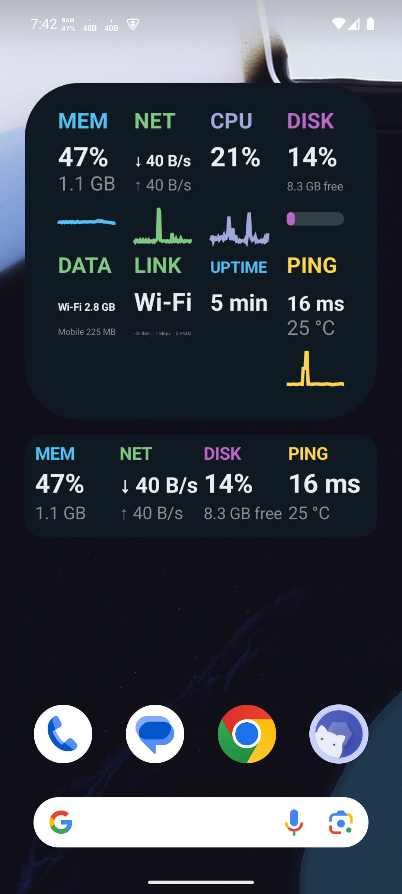 | 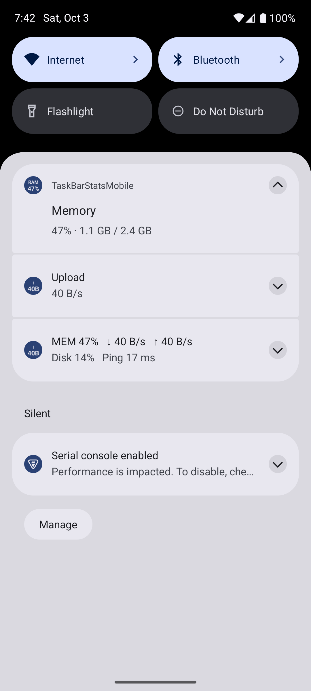 | 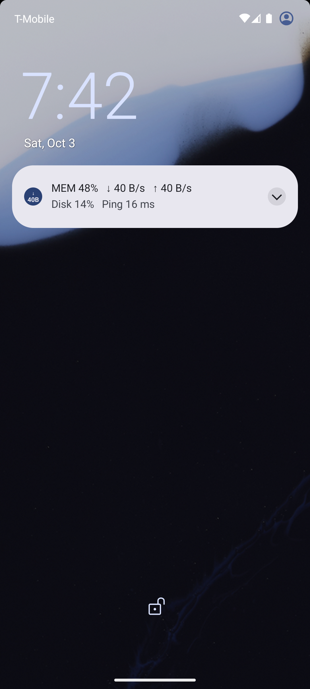 |

**Demo:** [57 s teaser](docs/videos/taskbarstatsmobile-teaser-en.mp4) · [151 s full tour](docs/videos/taskbarstatsmobile-tour-en.mp4) · [gif](docs/videos/taskbarstatsmobile-hero-en.gif) (portrait; screen recordings of the emulator with made-up traffic; toolkit in [tools/demo](tools/demo)).

[Privacy policy](PRIVACY.md) ([nl](PRIVACY.nl.md), [de](PRIVACY.de.md)): the app collects nothing and sends nothing except one ping connection to `1.1.1.1` (and, only if you switch it on, a daily update check on GitHub).

All screenshots come from an Android 15 emulator with its own (fake) traffic; no personal data.

## What it shows, and what Android allows

| Metric | Source | Notes |
|---|---|---|
| Memory | `ActivityManager.MemoryInfo` | |
| Network speed | `TrafficStats` | shown as `850B`, `9.4K`, `397K`, `2.0M`, `112M` in the status bar |
| Storage | `StatFs` | |
| Ping | TCP connect to 1.1.1.1:443 | |
| Temperature | battery temperature + `PowerManager` thermal status | no per-core sensors on Android |
| CPU % | `/proc/stat` | **blocked for normal apps since Android 8.** Works through [Shizuku](https://shizuku.rikka.app/) (below), or on rooted / old devices |
| GPU, FPS | not available | |

All values are clamped to 0–100 % before they are drawn, so a bar can never be longer than its track.

## Status bar mini-stats

Android does not let apps draw inside the status bar, so the app shows a small, non-touchable overlay window of
exactly the status-bar height (permission *Display over other apps*; the button opens the right settings page).

- Two lines of tiny text: `CPU | RAM | ↓↑ | PING`. CPU only appears when it is available.
- Position: **After clock** or **Before icons**, plus â—€ â–¶ buttons to nudge it in 8 dp steps to a free spot.
- The pill is sized by its content (with fixed minimum widths so it does not jitter) and shrinks, then drops the
  CPU and ping cells, on narrow screens so it never covers the clock or system icons.
- It hides itself when the status bar is hidden (video, games, the cockpit) and comes back with it.
- It is refreshed every 2 s by the live monitor service (*Start live monitor*, or automatically at app start when the overlay is on).
- It cannot appear on the lock screen (Android hides overlays there); the notification does show there.

## Tiles (visibility and order)

The **Tiles** tab switches each tile (memory, network, storage, ping, temperature, CPU, connection, Wi-Fi data, mobile data, uptime) on or off and moves it up or
down. The order and visibility apply to the dashboard (ping and temperature sit side by side when they follow each
other) and to the fullscreen cockpit (network becomes a download and an upload cell). *Reset tiles* restores the default.

The Wi-Fi and mobile data tiles show the data use over a period you choose at the top of the tab (today, 7 or 30 days; needs Usage Access).

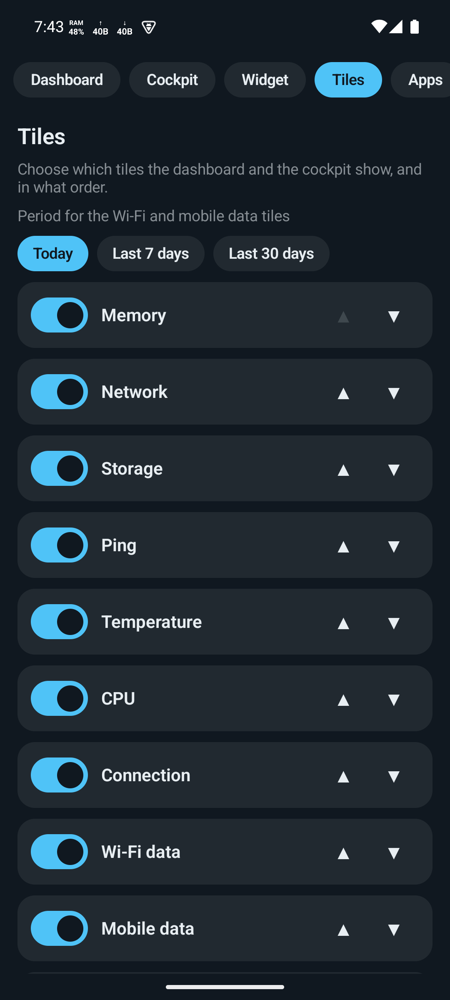

## Widgets and Quick Settings tile

In the Widget tab every type is shown as a live picture; tap a picture to put that widget on your home screen. There are six widget types you can mix and place as often as you like: **Mini** (1x1, one number), **Duo** (2x1, two items), **Small** (2x2, one item, default network), **Strip** (4x1, no graphs), **Dashboard** (4x2, with graphs) and **Large** (4x3, all info in two rows: memory, network, CPU, storage, data use, ping, connection and uptime). Every home-screen widget has its own settings (cells MEM / NET / CPU / DISK / DATA / PING / TEMP / LINK / UPTIME, graphs and bars on or off, and the background opacity, 20-100 %),
stored per widget id. Open them with **Widget N settings** in the Widget tab (launchers do not open the settings of a
pinned widget by themselves) or with *Reconfigure* on the widget. The widget is resizable and draws itself in the
aspect ratio you give it. The **Quick Settings tile** (add it from the tile editor) shows `RAM 46%` and the network
speed and switches the live monitor on or off with a tap.

The gallery in the Widget tab (each picture is a button):

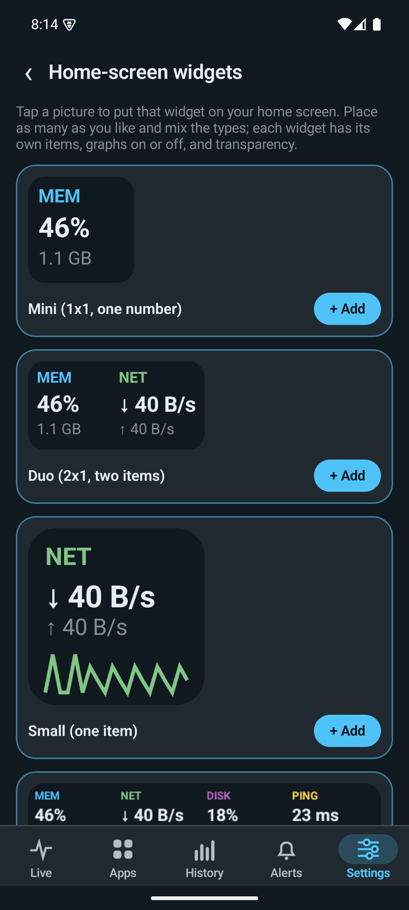

Widgets on the home screen (Large, Strip, Duo and Mini):

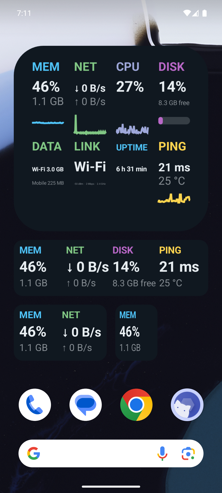

Widget settings (with the graphs switch) and the Quick Settings tile:

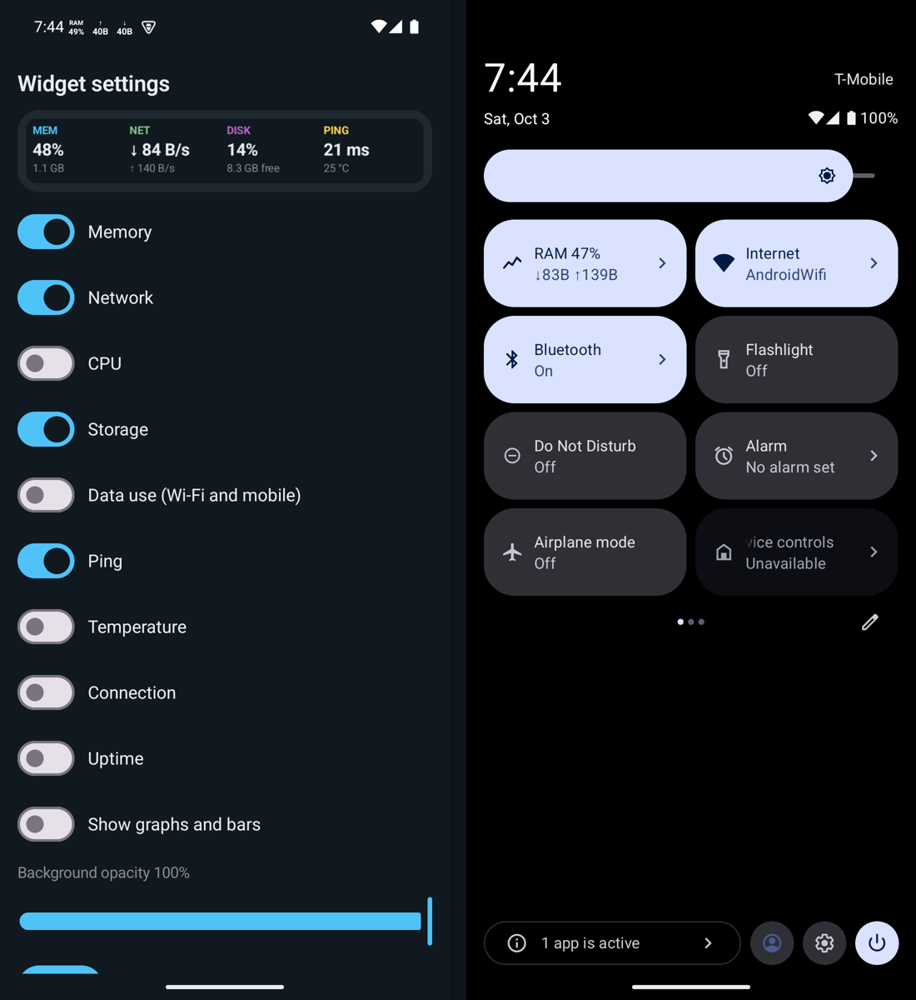

## More tabs: Apps, History, Alerts, Permissions

| Tab | What it does | Needs |
|---|---|---|
| **Apps → Data use** | Wi-Fi and mobile data per day, last 7 or 30 days, with a total | Usage access |
| **Apps → Traffic per app** | download / upload per app (today, 7 or 30 days) | Usage access |
| **Apps → Storage per app** | app, data and **cache** per app, the total cache, sorting by size or cache. Tap an app for its numbers and the ways to clear cache: *Clear all caches* (Shizuku frees the cache of all apps at once; apps in use or managed by the system may keep some), the app's info page (Storage → Clear cache; Android only lets an app clear its own cache otherwise) or the storage settings | Usage access (clear all: Shizuku) |
| **Apps → Most used apps** | screen time per app | Usage access |
| **Apps → Autostart** | apps that registered for `BOOT_COMPLETED` (Android has no real autostart list) | nothing (`QUERY_ALL_PACKAGES` is granted at install) |
| **Apps → Processes** | running processes with CPU and RAM, every 3 s. Tap one for details (command line, who started it, user, age, what keeps it running, its components) and actions: open the app (brings it to the front), app info, force stop, end the process, copy the command line | Shizuku |
| **History** | per-minute averages of memory, network, ping and CPU for up to 24 h (in memory: it builds up while the app is open or the live monitor runs) | nothing |
| **Alerts** | notification when memory, storage, ping or temperature goes over a limit (off by default, max one per 10 min per item, needs the live monitor) | notifications |
| **Permissions** | one card per optional permission with its state and a button that opens exactly the right Android page (notifications, display over other apps, usage access, battery optimisation, Shizuku) | - |

Two more tiles: **Connection** (Wi-Fi / mobile, signal in dBm, link speed, band) and **Uptime**. Everything that needs a
special permission is explained where it is used and links straight to the right settings page; the state is re-read when
you come back. Nothing leaves the device.

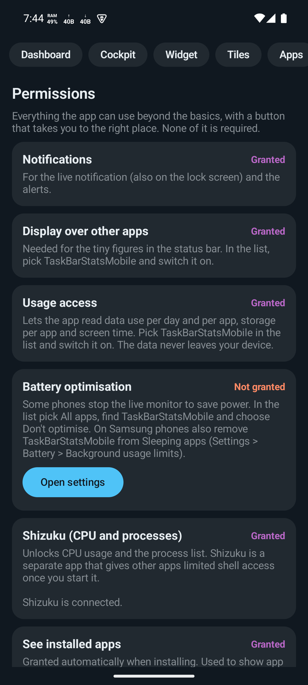

| Traffic per app | Processes (Shizuku) | History | Data tiles |
|---|---|---|---|
| 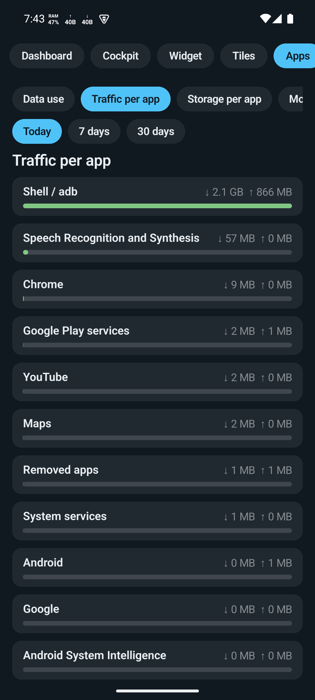 | 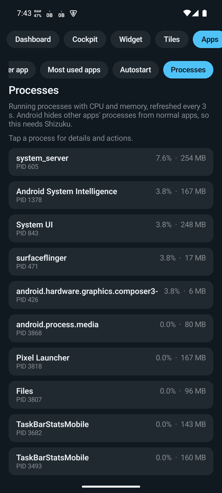 | 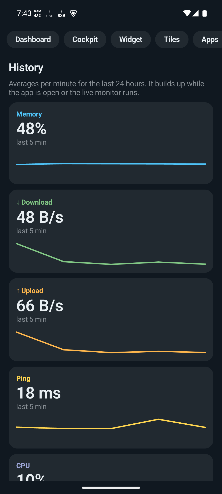 | 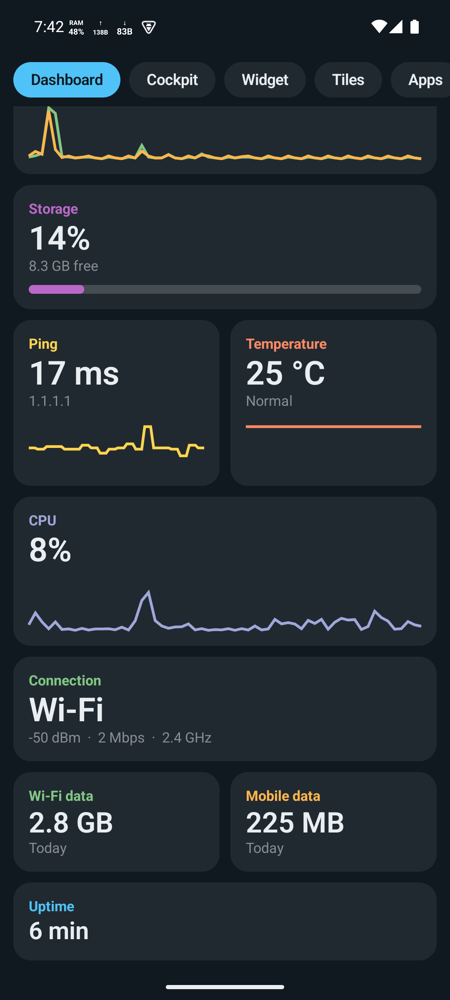 |

## First start and status bar items

On first start (and via *Run setup again* in the Widget tab) a setup screen asks **what** to show (download, upload,
memory, CPU, storage, ping, temperature - any combination) and **where**:

- **Icons next to the clock**: one status bar icon per item with the value drawn into it (a small label above the
  value, e.g. `RAM 46%`, `↓ 123B`). Needs no extra permission. Android decides the exact order and place (always on the
  left, next to the clock). The first item sits on the icon of the main notification, the others get their own
  notification (separate groups, otherwise Android folds them into one generic icon; normal importance but no sound,
  because some phones hide the icons of silent notifications).
- **Text strip**: one strip with all chosen items after the clock or before the system icons (needs *Display over other
  apps*; the setup screen opens the right page). When icons are also on, the strip starts after them. Download and upload
  share one two-line cell.

Both can be on at the same time. *Start* starts the live monitor straight away. In the Widget tab, *Notification* →
*Only when connected* hides the icons while there is no connection (the main notification must stay: Android requires
one for a foreground service).

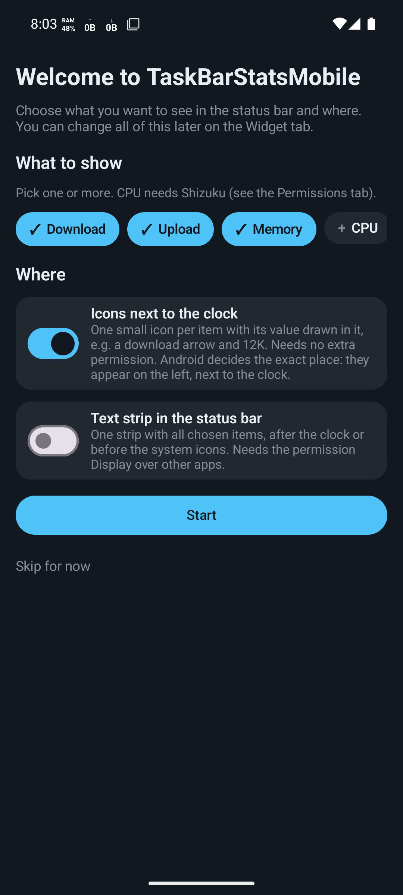

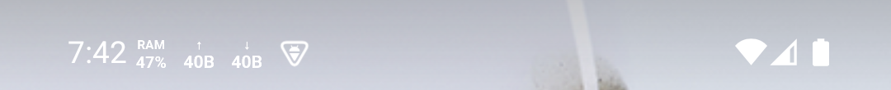

| Process details | Cache per app | Icons only |
|---|---|---|
| 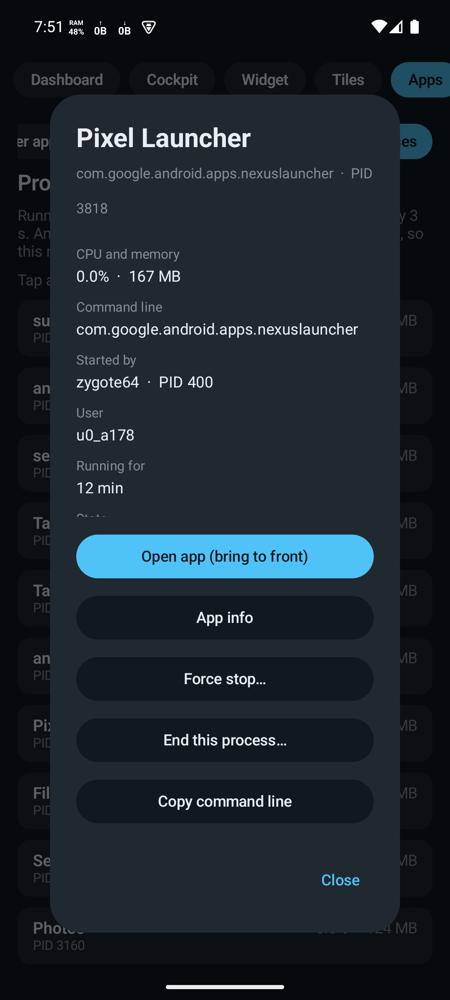 | 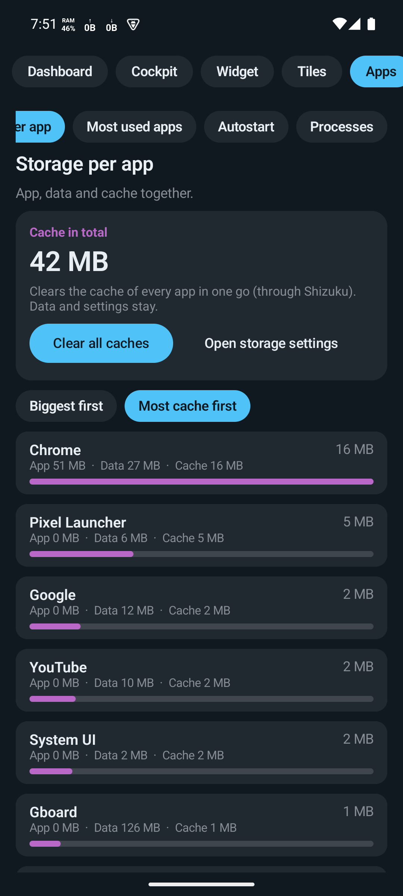 | 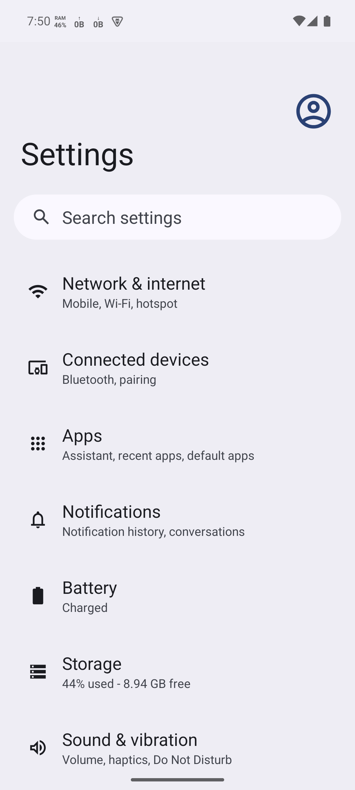 |

## Camera cut-out

A front camera in the middle of the top edge no longer hides part of the app. With **Keep clear of the camera** (Widget tab, on by default) the dashboard, the fullscreen cockpit and the status bar strip are drawn around the cut-out instead of behind it; the strip stays on its side of the camera and shrinks or drops cells if there is too little room. Choose **Centered, around camera** as the position and the strip is split in two halves, one left and one right of the camera (without a camera it is one centered strip). Every chosen item stays in the strip (CPU, ping, temperature, storage and so on); the text just gets smaller when space is tight. Switch on **Hide items when space is tight** to let CPU, ping, temperature and storage drop out instead. The halves are balanced by the room on each side. Top: with the switch on; bottom: camera option off.

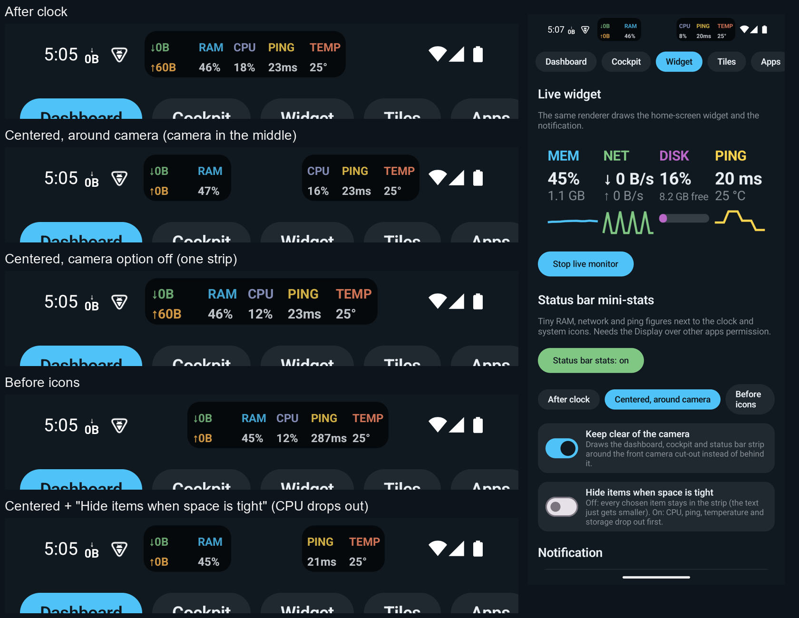

Pick the position in a **preview of the status bar**: tap the left (next to the clock), the middle (around the camera) or the right (before the icons). The preview shows the camera, the free space and the strip to scale. If part of the strip still ends up behind the camera, switch off *Detect the camera automatically* and set the **camera width**, the **extra free space** on both sides and the **position** yourself; all sizes are in screen pixels (for example camera 50 px, 5 px free on each side). The preview and the real status bar follow immediately, and while you move a slider a red marker shows the camera (dark) and the free space (light) on the real status bar. If your phone does not report a camera cut-out, the width slider is available even with automatic detection on.

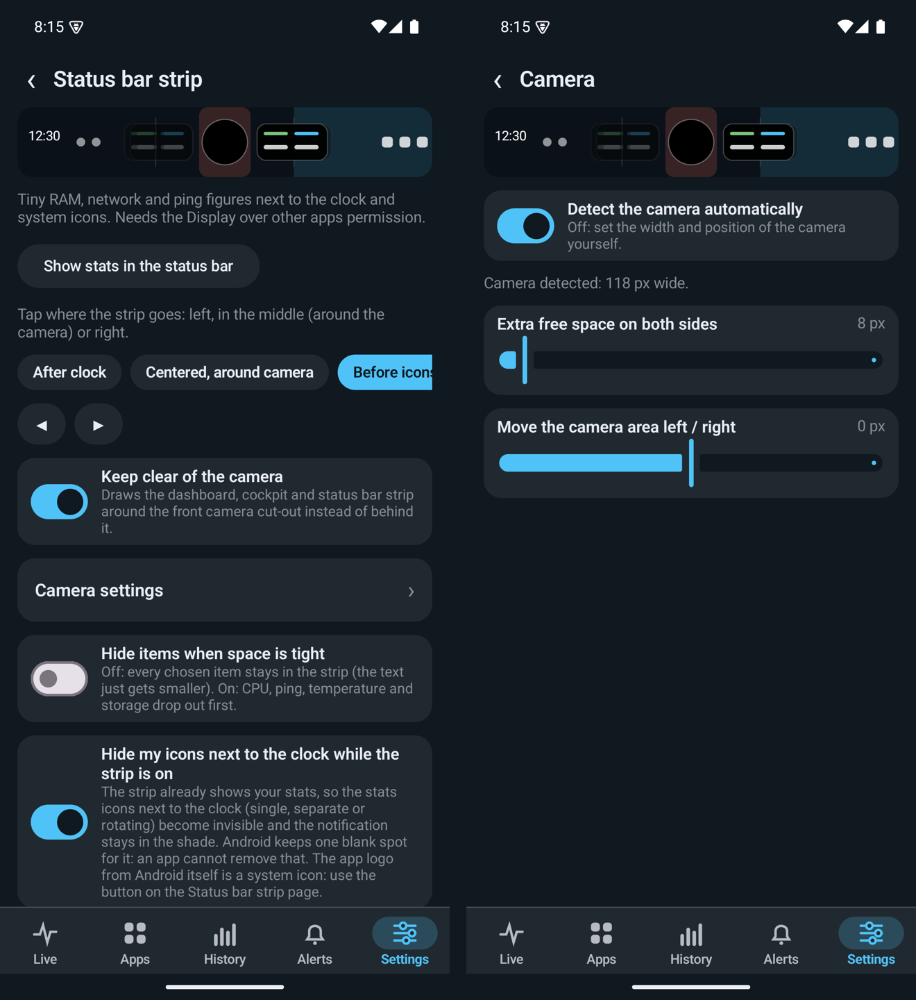

**The up/down meter next to the clock:** while the strip is on, the app's own stats icon next to the clock would show the same numbers twice. *Hide my own icon while the strip is on* (on by default) makes it invisible. It is not used when separate or rotating icons are on.

**The app logo next to the clock:** while the strip is on, Android itself adds a small "displaying over other apps" icon with the app logo. An app cannot remove it, but the button *Hide the Android "over other apps" icon* opens the system setting where you can switch that notification off (on many phones; some phones lock it).

**One icon that rotates:** many phones show only one of the status bar icons. Switch on *Rotate in one icon* and the single icon switches between the chosen items every few seconds (off by default).

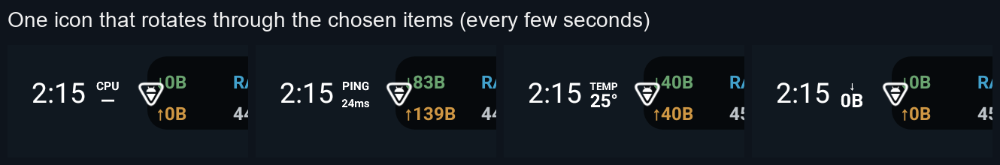 The main notification icon always shows a live figure (the first chosen item, by default the download speed), never the fixed app icon.

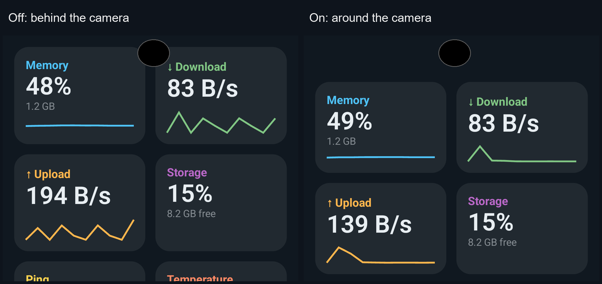

## Lock screen

The ongoing notification (`MEM 50% ↓ ↑ / Disk 13% Ping 17 ms`, with a **Stop** button that ends the live monitor) is public on the lock screen. The channel has normal
importance (Android hides low-importance notifications on the lock screen) but no sound or vibration.

## Themes

The same 14 colour themes as the Windows app (Default, Dark, Light, Love, CGA, Matrix, Amber, Game Boy, Dracula,
Ocean, Sunset, Forest, Neon, …) plus the app's own. They colour the app, the widget and the notification;
on light themes the fixed series colours are darkened automatically for contrast. **Import Windows theme (.json)**
reads a theme file from the Windows app (`TextColor`, `BackgroundColor`, `AccentColor`, `WarnColor`).

## Updates

Optional and off by default: *Check for updates* (Widget tab) asks GitHub once a day for the latest release and tells you once per new version. *Download and install* opens the APK link in your browser; Android asks for confirmation before installing. Hidden when the app comes from the Play Store. See the [privacy policy](PRIVACY.md).

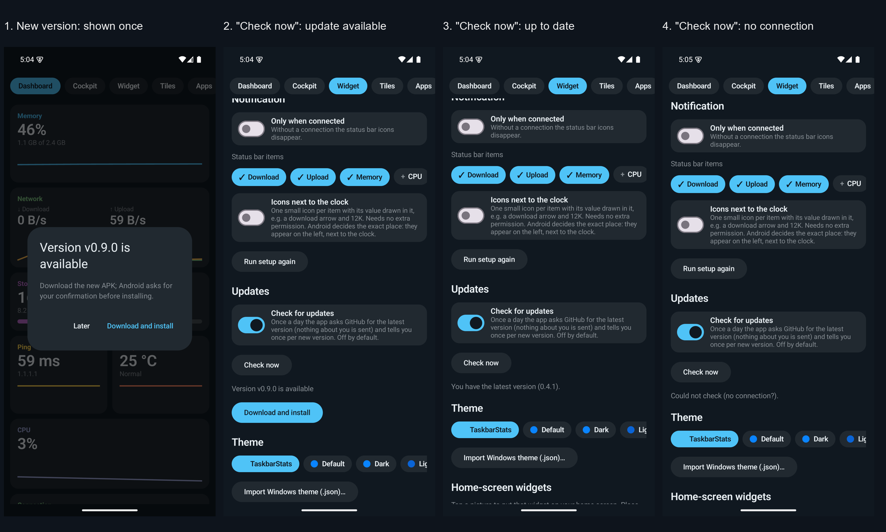

## Languages

English, Dutch and German (`res/values*/strings.xml`), following the system language (per-app language on Android 13+).

## CPU % with Shizuku

1. Install the Shizuku app and start it (Android 11+: wireless debugging, no PC needed; or `adb`).
2. Open TaskBarStatsMobile; the CPU tile says what is missing. Tap **Allow Shizuku access** and accept Shizuku's question.
3. TaskBarStatsMobile starts a tiny `UserService` through Shizuku (shell privileges) that reads `/proc/stat` for it.

Shizuku has to be started again after a reboot (except on Android 13+ with its auto-start on trusted Wi-Fi).
`dumpsys cpuinfo` with the `DUMP` permission was tried and does **not** work: the service is invisible to normal apps (SELinux).

## Building

Needs JDK 17 and the Android SDK (platform 35, build-tools 35). Gradle comes from the wrapper.

```
./gradlew assembleDebug        # -> app/build/outputs/apk/debug/app-debug.apk
adb install -r app/build/outputs/apk/debug/app-debug.apk
```

`start-emulator.bat` starts the emulator (AVD `tsphone`) and waits until it has booted; `start-emulator.bat install` also builds and installs the debug app.

local.properties (with `sdk.dir`) is git-ignored. Tested on an Android 15 emulator (x86_64, Google APIs) only;
the Shizuku flow was tested on the emulator with the Shizuku server started through `adb`, not on real hardware.

## Release build

`build-release.bat` (or `./gradlew assembleRelease bundleRelease`) makes a signed, shrunk (R8) APK of
about 1 MB and an AAB. It needs `keystore.properties` and `taskbarstats-release.jks` next to `gradlew`; both are
**git-ignored** and are generated once with `keytool` (RSA 2048, valid 10000 days). **Back them up**: a release signed
with another key cannot update an installed one. R8 keeps the Shizuku `UserService` and the AIDL stubs
(`app/proguard-rules.pro`). The release build was tested on the emulator: UI, widget, Quick Settings tile and the
Shizuku CPU source all work after shrinking. A draft store listing is in [PLAY-STORE.md](PLAY-STORE.md). The CI job (`.github/workflows/android.yml`) builds the debug APK and runs lint on every change to the code.

## Code overview

| File | Role |
|---|---|
| `Sampler.kt` | one sampler thread (1 s) + a ping thread; `Snapshot` = immutable moment (like `MetricsSnapshot` on Windows); history rings |
| `StatsRenderer.kt` | draws the widget to a plain `Bitmap` (same renderer for widget, notification and in-app preview) |
| `StatusBarOverlay.kt` | the status-bar pill: placement, fitting, fullscreen detection (window insets) |
| `MonitorService.kt`, `StatsWidget.kt` | foreground service (widget + notification every 2 s), `AppWidgetProvider` |
| `MainActivity.kt` | Compose UI: Dashboard, Cockpit (immersive, keeps screen on), Widget/settings tab |
| `Tiles.kt` | which tiles are shown and in what order (dashboard and cockpit) |
| `WidgetOptions.kt`, `WidgetConfigActivity.kt` | per-widget cells and opacity, and the settings screen |
| `StatsTileService.kt` | the Quick Settings tile |
| `Themes.kt`, `Fmt.kt` | palettes and Windows-theme import; number formatting |
| `ShizukuCpu.kt`, `aidl/IStatsService.aidl` | optional CPU source and process list (`top`) through Shizuku's `UserService` |
| `AppData.kt` | usage access, data use, per-app traffic / storage / screen time, autostart list, process parsing |
| `Alerts.kt` | threshold notifications |
| `StatusItems.kt`, `Setup.kt` | the chosen status bar items (icon drawing, values) and the first-start setup screen |
| `Tabs2.kt` | the Apps, History, Alerts and Permissions tabs |

## Not done yet

Persistent history (it is kept in memory only), the Play Store graphics, and a check on real
hardware (everything was tested on an Android 15 emulator).
